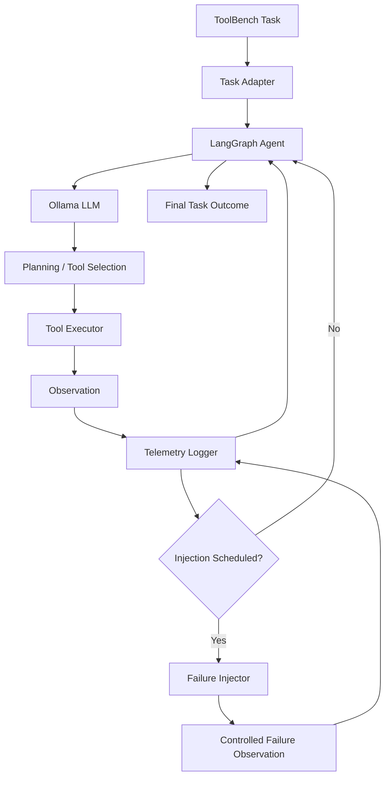
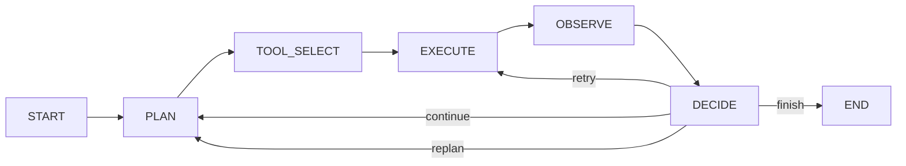
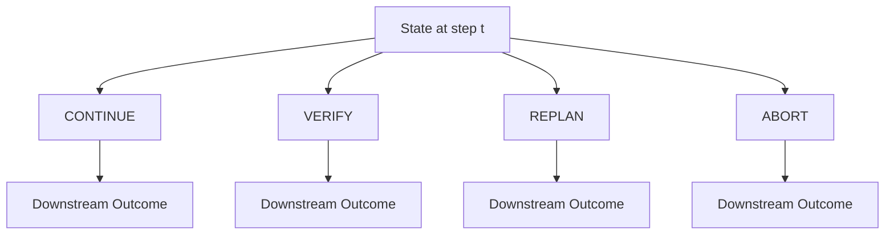
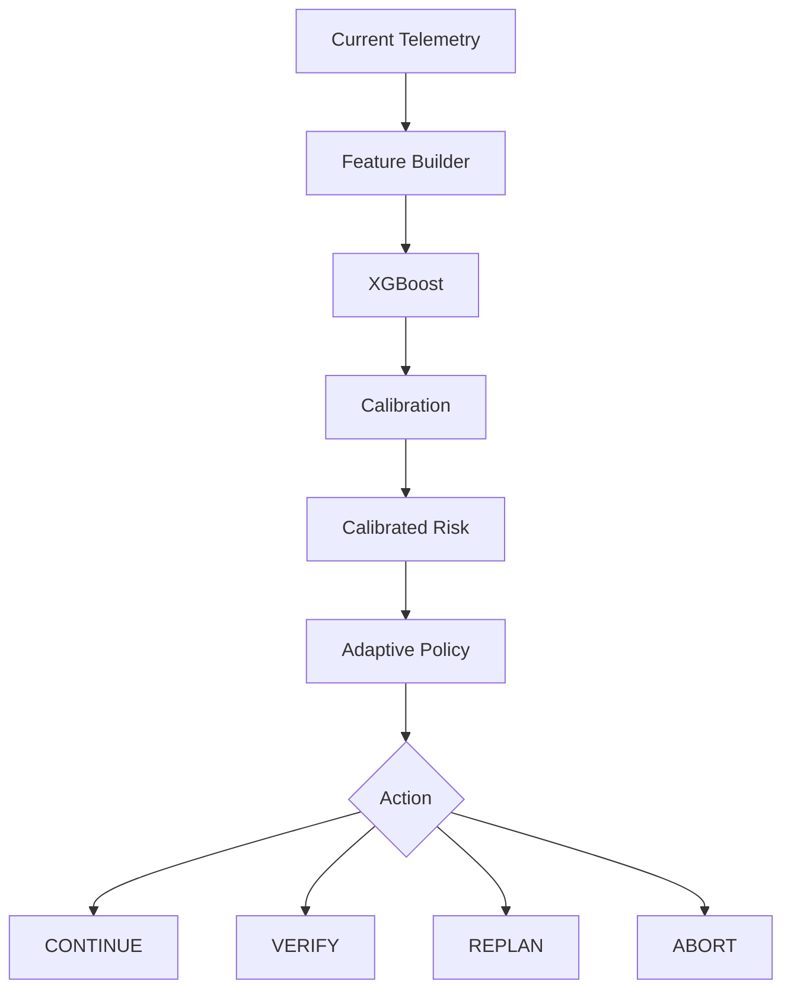
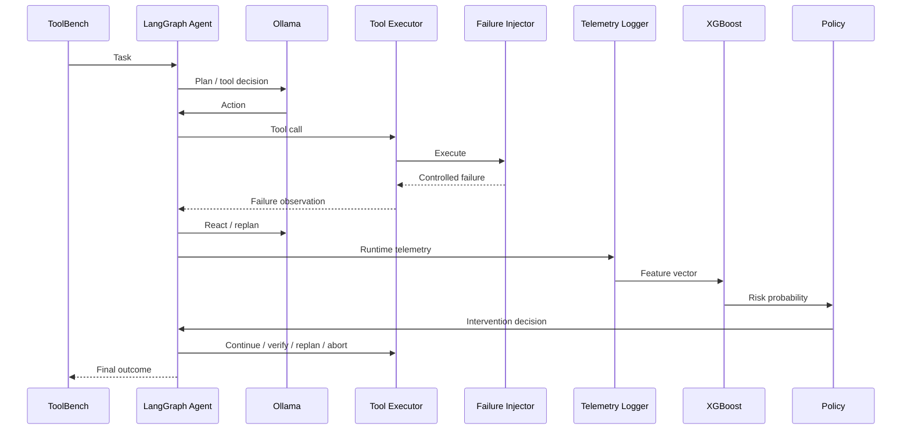
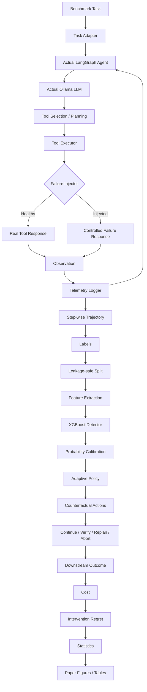

# PROMPT.md

# Lightweight Telemetry Classifiers as Runtime Guardrails for LLM Agents

## Full Antigravity / Coding-Agent Implementation Specification

> **Instruction:** Treat this document as the authoritative
> implementation specification for the current research prototype. Build
> the system in the exact gated order described below. Do not skip
> validation gates, do not fabricate experimental results, and do not
> silently replace the actual LLM-agent execution with a simulator or
> replay engine.

------------------------------------------------------------------------

# 1. ROLE AND PRIMARY OBJECTIVE

You are implementing a rigorous research prototype for the project:

**Lightweight Telemetry Classifiers as Runtime Guardrails for LLM
Agents**

The research question is:

> **Can cheap runtime telemetry gathered during execution of an LLM
> agent detect imminent agent failure before another LLM/tool call,
> without requiring an additional LLM judge call at every step?**

The project is a **research prototype**, not the final reusable SDK.

The implementation must experimentally evaluate this pipeline:

``` text
Benchmark Tasks
      |
      v
Actual LangGraph Agent
      |
      v
Actual Ollama LLM
(default: qwen3:8b)
      |
      v
Planning / Reasoning / Tool Selection
      |
      v
Tool Execution
      |
      v
Observation
      |
      v
Runtime Telemetry
      |
      +----------------------+
      |                      |
      v                      v
Healthy Execution      Controlled Failure
                           Injection
      |                      |
      +----------+-----------+
                 |
                 v
        Step-wise Trajectory
                 |
                 v
        Failure Labels
                 |
                 v
       Telemetry Features
                 |
                 v
       XGBoost Classifier
                 |
                 v
        Probability Calibration
                 |
                 v
       Adaptive Policy Model
                 |
                 +-----------------------------+
                 |                             |
                 v                             v
          Counterfactuals              Actual Execution
       CONTINUE / VERIFY /              Intervention
        REPLAN / ABORT                       |
                 |                             |
                 +-------------+---------------+
                               |
                               v
                    Intervention Regret
                               |
                               v
             Statistical Evaluation / Ablations
                               |
                               v
                         Research Paper
```

The final research prototype must answer:

1.  Can telemetry predict future/imminent failure?
2.  How early can it detect failure?
3.  How well calibrated are its probabilities?
4.  Which telemetry features matter?
5.  Does an adaptive intervention policy improve outcomes?
6.  When does intervention hurt an agent that would have recovered
    naturally?
7.  What is the intervention regret?
8.  Does the approach work on organic failures, not only injected
    failures?
9.  Does it generalize across tasks, failure types, agents, and models?
10. What is the cost/latency advantage over an LLM-as-a-judge baseline?

------------------------------------------------------------------------

# 2. NON-NEGOTIABLE PROJECT RULES

## 2.1 Actual LLM execution is mandatory

Use:

-   LangGraph for agent orchestration.
-   Ollama as the local LLM runtime.
-   Default model: `qwen3:8b`.
-   Model must remain configurable.

Example configuration:

``` env
LLM_PROVIDER=ollama
LLM_MODEL=qwen3:8b
OLLAMA_BASE_URL=http://localhost:11434
```

Do not replace the LLM with:

-   hard-coded actions,
-   a random policy,
-   a deterministic scripted agent,
-   prerecorded trajectories,
-   benchmark trajectories treated as the agent's own execution,
-   fake LLM responses.

The benchmark supplies tasks/environment information. The actual
LangGraph agent must execute those tasks using the actual Ollama model.

------------------------------------------------------------------------

## 2.2 AgentErrorBench is not the execution engine

AgentErrorBench is used for:

-   failure taxonomy,
-   failure definitions,
-   failure examples,
-   failure mechanisms,
-   methodological guidance.

ToolBench is used as a realistic source of tool-use tasks.

The actual experimental trajectories must be generated by:

``` text
ToolBench task
    ->
Task Adapter
    ->
LangGraph agent
    ->
Ollama
    ->
real tool execution
    ->
observations
    ->
telemetry
```

Do not simply replay AgentErrorBench or ToolBench trajectories.

------------------------------------------------------------------------

## 2.3 Failure injection must happen during execution

Never do this:

``` python
trajectory[5]["failure"] = True
```

after a trajectory has already completed.

Instead:

``` text
LLM selects tool
      |
      v
Tool execution middleware
      |
      v
Failure injector checks scheduled condition
      |
      +---- no injection ----> real tool
      |
      +---- injection -------> controlled failure
                                      |
                                      v
                              failure observation
                                      |
                                      v
                                Ollama sees it
                                      |
                                      v
                         agent reacts / retries / replans
```

The failure must causally influence subsequent agent behavior.

------------------------------------------------------------------------

## 2.4 Injected fault != actual task failure

A trajectory may receive an injected fault and still recover.

Always distinguish:

-   `fault_injected`
-   `fault_exposed`
-   `agent_reacted`
-   `agent_recovered`
-   `agent_failed`
-   `task_success`

Never label every injected fault as an unsuccessful task.

------------------------------------------------------------------------

## 2.5 No dashboard

Do NOT build:

-   dashboard UI,
-   HTML dashboard,
-   JavaScript dashboard,
-   dashboard server,
-   live monitoring dashboard.

The current project must produce static research artifacts only:

-   calibration plots,
-   risk-vs-step plots,
-   lead-time plots,
-   regret distributions,
-   failure-type comparisons,
-   ablation plots,
-   generalization plots,
-   paper-ready tables.

------------------------------------------------------------------------

## 2.6 No final reusable SDK yet

Do not build the final:

``` python
from agentguard import Guardrail
```

SDK.

The current project establishes whether the research idea works.

A future major version may package the validated method into an SDK.

------------------------------------------------------------------------

# 3. DATASET AND RESEARCH SOURCES

Use these sources.

## 3.1 ToolBench

Official repository:

https://github.com/OpenBMB/ToolBench

Purpose:

-   realistic tool-use tasks,
-   tool definitions,
-   task/environment information.

------------------------------------------------------------------------

## 3.2 AgentErrorBench

Hugging Face dataset:

https://huggingface.co/datasets/davide221/agenterrorbench

Paper:

https://arxiv.org/abs/2509.25370

Use it primarily for failure taxonomy and evaluation methodology.

------------------------------------------------------------------------

## 3.3 Agent trajectory methodology reference

Dubey et al. methodology:

https://arxiv.org/abs/2608.02464

Repository:

https://github.com/sunnydubey1111/agent-trajectory-sentinel

Use this as a methodological reference.

Do not copy implementation code.

------------------------------------------------------------------------

## 3.4 Additional benchmarks

The project synopsis also identifies:

-   SWE-bench Lite
-   GAIA
-   Who&When

Do not add all of them at the beginning.

Start with ToolBench + AgentErrorBench.

Only add another benchmark after the ToolBench pipeline is stable.

------------------------------------------------------------------------

# 4. RESEARCH FAILURE TAXONOMY

Use the AgentErrorBench taxonomy as the primary conceptual taxonomy.

## Reflection

-   hallucination
-   causal_misattribution
-   outcome_misinterpretation
-   progress_misassessment

## Action

-   parameter_error
-   format_error
-   planning_action_disconnect

## Planning

-   constraint_ignorance
-   impossible_action
-   inefficient_planning

## Memory

-   incomplete_summary
-   false_memory_hallucination
-   retrieval_failure

## System

-   environment_error
-   llm_limit
-   tool_execution_error
-   step_limit_exhaustion

Also evaluate trajectory-level mechanisms:

-   goal_drift
-   looping
-   tool_cascade
-   grounding_loss
-   context_corruption

------------------------------------------------------------------------

# 5. FAILURE INJECTION DESIGN

Every experiment should conceptually be represented as:

``` text
task
x
failure_type
x
onset
x
severity
x
seed
```

## Onset

Default normalized onset values:

``` text
0.20
0.35
0.50
0.65
0.80
```

The exact actual injection step must always be recorded.

Example:

``` text
trajectory has 20 steps
onset = 0.50
scheduled injection ~= step 10
actual injection step = 10
```

Do not assume the normalized onset equals the final actual step if the
trajectory length changes.

------------------------------------------------------------------------

## Severity

Implement:

``` text
low
medium
high
```

Severity must have operational definitions for every injector.

Do not merely change the label.

------------------------------------------------------------------------

## Onset ramp

Where meaningful:

``` text
abrupt
moderate_ramp
slow_ramp
```

For failures where ramping is not meaningful, record:

``` text
not_applicable
```

------------------------------------------------------------------------

# 6. FAILURE INJECTOR CATEGORIES

Implement failure injectors in three categories.

## DIRECTLY_INJECTABLE

Examples:

-   tool_execution_error
-   parameter_error
-   format_error
-   environment_error
-   step_limit_exhaustion

## PARTIALLY_INJECTABLE

Examples:

-   tool_cascade
-   looping
-   goal_drift
-   grounding_loss
-   context_corruption
-   constraint_ignorance
-   inefficient_planning
-   planning_action_disconnect

These may require environment/tool/state manipulation rather than a
single failed tool call.

## ORGANIC_ONLY

Failures that should primarily be observed naturally when possible:

-   hallucination
-   causal_misattribution
-   outcome_misinterpretation
-   progress_misassessment
-   false_memory_hallucination
-   retrieval_failure
-   llm_limit

Do not force an artificial injector where it would invalidate the
research construct.

------------------------------------------------------------------------

# 7. PRIORITY INJECTORS

Implement these first:

1.  `tool_execution_error`
2.  `parameter_error`
3.  `format_error`
4.  `tool_cascade`
5.  `looping`
6.  `goal_drift`
7.  `grounding_loss`
8.  `context_corruption`
9.  `environment_error`
10. `step_limit_exhaustion`
11. `constraint_ignorance`
12. `inefficient_planning`
13. `planning_action_disconnect`

Start with `tool_execution_error` before implementing the rest.

------------------------------------------------------------------------

# 8. PROJECT DIRECTORY STRUCTURE

Create or adapt the project to this structure.

``` text
llm-agent-failure-research/
|
+-- README.md
+-- PROMPT.md
+-- pyproject.toml
+-- requirements.txt
+-- .env.example
+-- .gitignore
|
+-- configs/
|   +-- base.yaml
|   +-- ollama.yaml
|   +-- injection.yaml
|   +-- telemetry.yaml
|   +-- features.yaml
|   +-- labels.yaml
|   +-- training.yaml
|   +-- calibration.yaml
|   +-- policy.yaml
|   +-- evaluation.yaml
|   +-- costs.yaml
|   +-- experiments/
|
+-- data/
|   +-- raw/
|   |   +-- toolbench/
|   |   +-- agenterrorbench/
|   |   +-- other/
|   |
|   +-- generated/
|   |   +-- healthy/
|   |   +-- injected/
|   |   +-- organic/
|   |
|   +-- processed/
|   |   +-- trajectories/
|   |   +-- telemetry/
|   |   +-- features/
|   |   +-- labels/
|   |
|   +-- splits/
|       +-- train/
|       +-- validation/
|       +-- test/
|       +-- external/
|
+-- agent/
|   +-- langgraph/
|   |   +-- graph.py
|   |   +-- state.py
|   |   +-- nodes.py
|   |   +-- planner.py
|   |   +-- executor.py
|   |   +-- prompts.py
|   |   +-- termination.py
|   |
|   +-- tools/
|   |   +-- registry.py
|   |   +-- adapters.py
|   |   +-- execution.py
|   |
|   +-- execution/
|       +-- runner.py
|       +-- healthy.py
|       +-- injected.py
|       +-- organic.py
|
+-- benchmarks/
|   +-- toolbench/
|   |   +-- downloader.py
|   |   +-- adapter.py
|   |   +-- parser.py
|   |   +-- validator.py
|   |
|   +-- agenterrorbench/
|       +-- loader.py
|       +-- taxonomy.py
|       +-- validator.py
|
+-- failure_taxonomy/
|   +-- taxonomy.py
|   +-- definitions.py
|   +-- mapping.py
|
+-- failure_injection/
|   +-- base.py
|   +-- scheduler.py
|   +-- registry.py
|   +-- direct/
|   |   +-- tool_execution_error.py
|   |   +-- parameter_error.py
|   |   +-- format_error.py
|   |   +-- environment_error.py
|   |   +-- step_limit_exhaustion.py
|   |
|   +-- behavioral/
|       +-- looping.py
|       +-- tool_cascade.py
|       +-- goal_drift.py
|       +-- grounding_loss.py
|       +-- context_corruption.py
|       +-- constraint_ignorance.py
|       +-- inefficient_planning.py
|       +-- planning_action_disconnect.py
|
+-- telemetry/
|   +-- schema.py
|   +-- logger.py
|   +-- collector.py
|   +-- context_tracker.py
|   +-- token_tracker.py
|   +-- latency.py
|   +-- state_hash.py
|
+-- features/
|   +-- builder.py
|   +-- tool_features.py
|   +-- error_features.py
|   +-- retry_features.py
|   +-- temporal_features.py
|   +-- context_features.py
|   +-- argument_features.py
|   +-- semantic_features.py
|   +-- uncertainty_features.py
|   +-- registry.py
|
+-- labels/
|   +-- future_failure.py
|   +-- imminent_failure.py
|   +-- event_labels.py
|   +-- leakage.py
|
+-- models/
|   +-- baselines/
|   |   +-- majority.py
|   |   +-- logistic.py
|   |   +-- random_forest.py
|   |   +-- extra_trees.py
|   |   +-- heuristics.py
|   |
|   +-- failure_detector/
|   |   +-- xgboost_model.py
|   |   +-- lightgbm_model.py
|   |
|   +-- calibration/
|       +-- platt.py
|       +-- isotonic.py
|       +-- evaluator.py
|
+-- counterfactual/
|   +-- state_capture.py
|   +-- branching.py
|   +-- continue_action.py
|   +-- verify_action.py
|   +-- replan_action.py
|   +-- abort_action.py
|   +-- runner.py
|
+-- policy/
|   +-- state.py
|   +-- actions.py
|   +-- costs.py
|   +-- dataset.py
|   +-- baselines.py
|   +-- adaptive.py
|   +-- trainer.py
|
+-- evaluation/
|   +-- detector_metrics.py
|   +-- calibration_metrics.py
|   +-- early_detection.py
|   +-- policy_metrics.py
|   +-- regret.py
|   +-- organic.py
|   +-- generalization.py
|   +-- ablations.py
|   +-- statistics.py
|
+-- experiments/
|   +-- experiment_registry.py
|   +-- seeds.py
|   +-- runners.py
|   +-- manifests.py
|
+-- scripts/
|   +-- download_datasets.py
|   +-- validate_datasets.py
|   +-- smoke_test_ollama.py
|   +-- smoke_test_agent.py
|   +-- run_healthy.py
|   +-- run_injected.py
|   +-- run_organic.py
|   +-- build_labels.py
|   +-- build_splits.py
|   +-- check_leakage.py
|   +-- build_features.py
|   +-- validate_features.py
|   +-- train_baselines.py
|   +-- train_detector.py
|   +-- evaluate_detector.py
|   +-- calibrate.py
|   +-- evaluate_calibration.py
|   +-- evaluate_early_detection.py
|   +-- generate_counterfactuals.py
|   +-- run_counterfactuals.py
|   +-- build_policy_dataset.py
|   +-- train_policy.py
|   +-- evaluate_policy.py
|   +-- compute_regret.py
|   +-- evaluate_organic.py
|   +-- evaluate_generalization.py
|   +-- run_ablations.py
|   +-- run_statistics.py
|   +-- generate_figures.py
|   +-- generate_tables.py
|   +-- run_reproducibility_check.py
|
+-- tests/
|   +-- unit/
|   +-- integration/
|   +-- leakage/
|   +-- failure_injection/
|   +-- telemetry/
|   +-- features/
|   +-- models/
|   +-- policy/
|   +-- counterfactual/
|   +-- reproducibility/
|
+-- notebooks/
|   +-- 01_trajectory_inspection.ipynb
|   +-- 02_telemetry_analysis.ipynb
|   +-- 03_detector_analysis.ipynb
|   +-- 04_calibration.ipynb
|   +-- 05_policy_analysis.ipynb
|   +-- 06_regret_analysis.ipynb
|   +-- 07_generalization.ipynb
|   +-- 08_ablation.ipynb
|
+-- results/
|   +-- manifests/
|   +-- metrics/
|   +-- models/
|   +-- figures/
|   +-- tables/
|   +-- reports/
|   +-- logs/
|
+-- docs/
    +-- methodology.md
    +-- experiment_protocol.md
    +-- failure_taxonomy.md
    +-- reproducibility.md
    +-- professor_demo.md
```

------------------------------------------------------------------------

# 9. CORE EXECUTION FLOW

The real execution flow must be:



The injection must happen in the execution path.

------------------------------------------------------------------------

# 10. THREE EXECUTION MODES

## Mode A: Healthy

``` text
ToolBench task
    ->
LangGraph
    ->
Ollama
    ->
Tools
    ->
Observations
    ->
Telemetry
    ->
Final outcome
```

No artificial failure.

------------------------------------------------------------------------

## Mode B: Injected

``` text
ToolBench task
    ->
LangGraph
    ->
Ollama
    ->
Tool selection
    ->
Failure scheduler
    ->
Controlled failure
    ->
Observation delivered to Ollama
    ->
Agent reaction
    ->
Continue / retry / replan / fail / recover
    ->
Final outcome
```

------------------------------------------------------------------------

## Mode C: Organic

``` text
ToolBench task
    ->
LangGraph
    ->
Ollama
    ->
Real execution
    ->
Naturally occurring failure
    ->
Telemetry
    ->
Recovery/failure
    ->
Final outcome
```

Injected and organic failures must be evaluated separately.

------------------------------------------------------------------------

# 11. OLLAMA CONFIGURATION

Create:

``` yaml
provider: ollama
base_url: http://localhost:11434
model: qwen3:8b
temperature: 0
```

Make all values configurable.

Environment:

``` env
LLM_PROVIDER=ollama
LLM_MODEL=qwen3:8b
OLLAMA_BASE_URL=http://localhost:11434
OLLAMA_TEMPERATURE=0
```

Initial setup:

``` bash
ollama pull qwen3:8b
ollama list
ollama run qwen3:8b
```

Smoke test:

``` bash
python scripts/smoke_test_ollama.py
```

The smoke test must verify:

1.  Ollama is reachable.
2.  Model exists.
3.  A prompt returns a response.
4.  The response can be consumed by the LangGraph node.
5.  Token/latency metadata is handled correctly where exposed.

Never fabricate token/logprob data when Ollama does not expose it.

------------------------------------------------------------------------

# 12. LANGGRAPH AGENT REQUIREMENTS

The LangGraph graph must have real nodes corresponding to the agent
workflow.

A compatible conceptual graph is:



The actual graph can differ if an existing project already contains a
working LangGraph architecture.

Important:

> If an existing LangGraph project exists in the repository, inspect it
> first and integrate the telemetry/injection system around it. Do not
> throw away a working agent and replace it with a fake example.

The agent must make actual LLM-driven decisions.

------------------------------------------------------------------------

# 13. TRAJECTORY SCHEMA

Every trajectory must store:

``` text
trajectory_id
task_id
benchmark
benchmark_version
execution_mode
agent_name
agent_version
llm_provider
llm_model
llm_version
seed

failure_module
failure_type
failure_mechanism

fault_injected
fault_exposed
injection_step
actual_failure_step

severity
onset_ramp

agent_recovered
agent_failed
task_success

num_steps
total_latency
total_tokens
total_tool_calls

start_time
end_time
```

------------------------------------------------------------------------

# 14. STEP TELEMETRY SCHEMA

Every step must store:

``` text
trajectory_id
step
timestamp
state_hash

task_text
goal_representation

llm_action
tool_name
tool_arguments
tool_response

tool_success
error_flag
error_type

retry_count

latency
llm_latency
tool_latency

input_tokens
output_tokens
total_tokens

context_length
message_count

termination_status
```

Do not insert information that was not available at that step.

------------------------------------------------------------------------

# 15. TELEMETRY FEATURE GROUPS

Implement the following.

## Tool features

``` text
tool_count
unique_tool_count
tool_diversity
tool_repeat_count
same_tool_streak
consecutive_tool_calls
tool_switch_rate
```

## Error features

``` text
error_count
error_rate
recent_error_rate
consecutive_errors
error_burst
tool_failure_frequency
```

## Retry features

``` text
retry_count
recent_retry_count
same_action_retry_count
```

## Temporal features

``` text
step_number
normalized_step
elapsed_time
rolling_latency
latency_slope
latency_variance
```

## Context features

``` text
context_length
context_growth
message_count
token_growth_rate
```

## Argument features

``` text
argument_similarity
argument_change_rate
repeated_argument_rate
```

## Semantic features

Where computationally justified:

``` text
semantic_goal_similarity
semantic_drift
observation_action_similarity
trajectory_coherence
recent_step_similarity
state_transition_distance
```

## Uncertainty features

Only use:

``` text
entropy
logprob
confidence
```

if the actual Ollama/model runtime exposes valid measurements.

Never fabricate them.

------------------------------------------------------------------------

# 16. LABEL DEFINITIONS

The primary target is:

``` text
P(Failure_future | telemetry_<=t)
```

Create configurable prediction horizons:

``` text
H = 1
H = 2
H = 3
H = 5
H = 10
```

Do not hard-code one horizon without justification.

Maintain separate labels:

``` text
failure_eventual
failure_imminent
fault_exposed
actual_failure
```

Example:

``` text
At step t:

failure_imminent = 1

if actual failure occurs within H future steps.
```

The label itself can use future information.

The **features cannot**.

------------------------------------------------------------------------

# 17. LEAKAGE PREVENTION

The following must never be prediction features:

``` text
future failure
future tool calls
future errors
final outcome
actual_failure_step
injection_step
future telemetry
future trajectory length
future token count
future recovery status
```

Implement an automated leakage checker.

Example:

``` text
features
    |
    v
prohibited-column checker
    |
    +-- prohibited column found --> FAIL
    |
    +-- clean --------------------> PASS
```

Command:

``` bash
python scripts/check_leakage.py
```

The experiment must stop if leakage is detected.

------------------------------------------------------------------------

# 18. DATA SPLITS

Never randomly split individual step rows.

Use trajectory/task-aware splits.

Default:

``` text
70% train
15% validation
15% test
```

Prefer:

``` text
task-disjoint
trajectory-disjoint
```

where possible.

Maintain:

``` text
train
validation
test
external
```

No task should unintentionally appear in both training and test.

Record the exact split manifest.

------------------------------------------------------------------------

# 19. PILOT-FIRST EXPERIMENTAL STRATEGY

Do not generate thousands of trajectories immediately.

First run:

``` text
20–50 tasks
5–10 failure mechanisms
multiple onset positions
multiple severities
multiple seeds
healthy + injected + organic
```

The pilot must prove:

-   agent works,
-   Ollama works,
-   tools work,
-   telemetry works,
-   failure injector works,
-   failure reaches the LLM,
-   labels work,
-   no leakage,
-   schema works.

Only after the pilot passes should the experiment scale.

------------------------------------------------------------------------

# 20. PRIMARY FAILURE INJECTION: TOOL EXECUTION ERROR

Implement this first.

Example:

``` text
Agent chooses:
search_tool(query="...")

Injector intercepts execution.

Instead of normal tool response:

{
  "status": "error",
  "error_type": "tool_execution_error",
  "message": "Controlled execution failure"
}
```

The error must be realistic enough for the agent to reason about it.

Then:

``` text
error observation
      ->
Ollama
      ->
agent response
      ->
retry / alternative tool / replan / terminate
```

Record the complete causal chain.

------------------------------------------------------------------------

# 21. FAILURE INJECTION API

Create an interface similar to:

``` python
class FailureInjector:
    name: str

    def should_inject(
        self,
        context,
        step,
        telemetry,
        schedule,
    ) -> bool:
        ...

    def inject(
        self,
        tool_call,
        context,
        severity,
    ):
        ...
```

A scheduler should determine when an injector is eligible.

Example:

``` python
InjectionSchedule(
    normalized_onset=0.50,
    severity="medium",
    onset_ramp="abrupt",
    seed=42,
)
```

------------------------------------------------------------------------

# 22. COUNTERFACTUAL INTERVENTIONS

At selected state `t`, branch from the same available state/prefix:



The branch should share the same prefix whenever technically feasible.

Measure:

``` text
task success
task failure
recovery
additional LLM calls
additional tokens
additional tool calls
additional latency
failure cost
intervention cost
total cost
```

------------------------------------------------------------------------

# 23. INTERVENTION ACTIONS

## CONTINUE

Normal agent execution.

## VERIFY

Run deterministic checks such as:

-   schema validation,
-   argument validation,
-   tool-result consistency,
-   required-call checks,
-   state consistency,
-   task constraint checks.

Do not make verification another LLM judge unless explicitly evaluating
the judge baseline.

## REPLAN

Invoke the existing agent/Ollama planning mechanism to reconsider the
strategy.

## ABORT

Terminate the trajectory.

------------------------------------------------------------------------

# 24. ADAPTIVE POLICY

The policy is a research decision model.

It is NOT the final SDK guardrail.

Policy state should include:

``` text
telemetry
calibrated_risk
task_progress
resource_state
recent_intervention_history
```

Action space:

``` text
CONTINUE
VERIFY
REPLAN
ABORT
```

Conceptual policy:



------------------------------------------------------------------------

# 25. COST MODEL

Use:

``` text
C(a) =
    wf * C_failure
  + wl * C_latency
  + wt * C_tokens
  + wc * C_tool
  + wa * C_action
```

Predefine cost regimes:

``` text
failure-heavy
latency-heavy
token/API-cost-heavy
balanced
```

Do not choose the cost regime after looking at test results.

For each state:

``` text
a* = argmin_a C(a)
```

Describe this as:

> optimal under the experimentally defined cost model and evaluated
> action set

Do not claim it is universally optimal.

------------------------------------------------------------------------

# 26. INTERVENTION REGRET

For trajectory `i`:

``` text
R_i =
    C_i(policy_action)
    -
    min_a C_i(a)
```

Report:

``` text
mean regret
median regret
95% confidence interval
total regret
normalized regret
```

Break down by:

``` text
failure type
failure module
risk band
severity
onset
task
execution mode
```

A particularly important analysis:

> Identify cases where the policy intervened but the original agent
> would have self-corrected.

This measures harmful over-intervention.

------------------------------------------------------------------------

# 27. DETECTOR MODELS

## Primary

``` text
XGBoost
```

## Required baselines

``` text
majority classifier
logistic regression
random forest
ExtraTrees
simple telemetry heuristics
```

Heuristics include:

``` text
recent error threshold
retry threshold
same-tool repetition threshold
```

## Optional

``` text
LightGBM
```

Do not add unnecessarily complex models unless justified experimentally.

------------------------------------------------------------------------

# 28. CALIBRATION

Evaluate:

``` text
raw XGBoost
Platt scaling
isotonic regression
```

Calibration must be fitted using validation data.

The test set must remain untouched until final evaluation.

------------------------------------------------------------------------

# 29. DETECTOR METRICS

Required:

``` text
AUROC
AUPRC
precision
recall
F1
FPR
FNR
Brier score
ECE
```

Generate:

``` text
reliability diagram
risk-vs-step
ROC curve
precision-recall curve
```

------------------------------------------------------------------------

# 30. EARLY DETECTION METRICS

Measure:

``` text
early detection rate
first detection step
actual failure step
lead time
false alarm rate
```

Define:

``` text
lead_time =
    actual_failure_step
    -
    first_detection_step
```

Report:

``` text
mean
median
standard deviation
IQR
percentage detected before failure
```

Break down by:

``` text
failure type
failure module
severity
onset
benchmark
execution mode
```

------------------------------------------------------------------------

# 31. BASELINE POLICIES

Evaluate:

1.  Always Continue
2.  Deterministic Verification
3.  Fixed calibrated-risk threshold
4.  Multi-threshold policy
5.  Learned adaptive policy
6.  LLM-as-a-judge

------------------------------------------------------------------------

# 32. LLM-AS-A-JUDGE BASELINE

Use Ollama for the judge baseline as well.

Prefer a separately configured judge model:

``` env
JUDGE_LLM_PROVIDER=ollama
JUDGE_LLM_MODEL=qwen3:8b
```

If the same model is used, explicitly document this.

The judge must not be part of the telemetry detector.

Measure:

``` text
additional LLM calls
additional tokens
additional latency
task success
detection rate
false alarms
```

The research question is partly whether lightweight telemetry can
achieve useful prediction without paying for an LLM judge at every step.

------------------------------------------------------------------------

# 33. ORGANIC FAILURE VALIDATION

This is mandatory.

Run the agent without artificial injection.

Collect naturally occurring:

``` text
errors
loops
misinterpretations
tool misuse
failed plans
recoveries
```

Evaluate the trained detector on organic failures separately.

Never merge injected and organic results into one number without clearly
labeling provenance.

If performance decreases on organic failures, report it.

Do not tune the system to hide the degradation.

------------------------------------------------------------------------

# 34. GENERALIZATION

Evaluate:

## Unseen tasks

Train and test on disjoint ToolBench tasks.

## Held-out failure types

Where enough data exists:

``` text
train on some failure types
test on unseen failure types
```

## Cross-agent

If another compatible agent exists:

``` text
Agent A -> train
Agent B -> test
```

## Cross-model

If feasible:

``` text
Model A -> train
Model B -> test
```

## Recalibration

Compare:

``` text
zero-shot
small recalibration
larger recalibration
```

------------------------------------------------------------------------

# 35. ABLATION STUDY

Remove feature groups one at a time.

Required groups:

``` text
semantic features
tool features
error features
latency features
context features
argument features
uncertainty features
```

Compare:

``` text
detector metrics
calibration
early detection
policy performance
regret
```

------------------------------------------------------------------------

# 36. STATISTICAL RIGOR

Use multiple random seeds.

Report:

``` text
N
mean
median
95% CI
```

Use appropriate paired tests:

``` text
bootstrap
Wilcoxon signed-rank
McNemar
permutation tests
```

Choose based on the comparison.

Correct for multiple comparisons where appropriate.

Never cherry-pick the seed producing the best result.

------------------------------------------------------------------------

# 37. EXPERIMENT MANIFEST

Every experiment must save a manifest containing:

``` text
experiment_id
timestamp
git_commit
python_version
OS
hardware
ollama_version
llm_model
benchmark_version
dataset_revision/hash
agent_version
config_hash
random_seed
feature_version
model_version
cost_regime
```

This is mandatory for reproducibility.

------------------------------------------------------------------------

# 38. RESULT INTEGRITY

Never fabricate:

-   accuracy,
-   AUROC,
-   AUPRC,
-   calibration,
-   latency,
-   token savings,
-   regret,
-   success rates,
-   confidence intervals.

If something has not been executed:

``` text
NOT_AVAILABLE
```

Do not fill it with an expected result.

------------------------------------------------------------------------

# 39. CONFIGURATION DESIGN

Create separate YAML configurations.

Example `configs/base.yaml`:

``` yaml
llm:
  provider: ollama
  model: qwen3:8b
  base_url: http://localhost:11434
  temperature: 0

agent:
  name: research_langgraph_agent
  max_steps: 30

benchmark:
  name: toolbench

execution:
  mode: healthy
  seed: 42
```

Example `configs/injection.yaml`:

``` yaml
execution:
  mode: injected

failure:
  type: tool_execution_error
  normalized_onset: 0.50
  severity: medium
  onset_ramp: abrupt

seed: 42
```

------------------------------------------------------------------------

# 40. EXACT BUILD AND RUN ORDER

This sequence is mandatory.

Each phase has a gate.

Do not proceed to the next phase until the gate passes.

------------------------------------------------------------------------

## PHASE 0 --- INSPECT EXISTING PROJECT

First:

1.  Inspect all existing source files.
2.  Identify current LangGraph graph.
3.  Identify state definition.
4.  Identify LLM calls.
5.  Identify tools.
6.  Identify tool executor.
7.  Identify termination logic.
8.  Identify existing tests.
9.  Identify existing environment/dependency files.

If a working LangGraph project exists:

> integrate with it instead of recreating it.

Create:

``` text
docs/current_architecture.md
```

Document what already exists.

### Gate 0

The agent architecture is understood and documented.

------------------------------------------------------------------------

## PHASE 1 --- ENVIRONMENT + OLLAMA

Install dependencies.

Configure:

``` text
Python environment
Ollama
qwen3:8b
LangGraph
Pydantic
pandas
numpy
scikit-learn
xgboost
matplotlib
scipy
pytest
pyyaml
```

Run:

``` bash
ollama pull qwen3:8b
ollama list
ollama run qwen3:8b
python scripts/smoke_test_ollama.py
```

Then:

``` bash
python scripts/smoke_test_agent.py
```

### Gate 1

A real LangGraph agent produces a real response using Ollama.

------------------------------------------------------------------------

# 41. PHASE 2 --- DATASET INGESTION

Implement:

``` bash
python scripts/download_datasets.py
python scripts/validate_datasets.py
```

Store raw datasets under:

``` text
data/raw/
```

Never modify the raw source files.

Create processed copies if needed.

### Gate 2

The ToolBench task adapter returns valid tasks.

------------------------------------------------------------------------

# 42. PHASE 3 --- HEALTHY EXECUTION

Run exactly one task first:

``` bash
python scripts/run_healthy.py \
    --config configs/base.yaml \
    --limit 1
```

Inspect the resulting trajectory manually.

Then:

``` bash
python scripts/run_healthy.py \
    --config configs/base.yaml \
    --limit 10
```

Verify:

-   actual Ollama call,
-   actual LangGraph execution,
-   actual tool execution,
-   step records,
-   final outcome,
-   timestamps,
-   latency,
-   tokens where available.

### Gate 3

Healthy trajectories are valid and complete.

------------------------------------------------------------------------

# 43. PHASE 4 --- TELEMETRY

Instrument:

-   LLM calls,
-   tool calls,
-   observations,
-   errors,
-   retries,
-   context size,
-   token usage,
-   latency,
-   state transitions.

Run one task.

Inspect the JSON/Parquet trajectory.

### Gate 4

Telemetry is complete and causally ordered.

------------------------------------------------------------------------

# 44. PHASE 5 --- FIRST FAILURE INJECTOR

Implement:

``` text
tool_execution_error
```

Run:

``` bash
python scripts/run_injected.py \
    --config configs/injection.yaml \
    --failure-type tool_execution_error \
    --limit 1
```

Verify manually:

``` text
agent selected tool
        ->
injector intercepted
        ->
failure generated
        ->
failure entered observation
        ->
Ollama received failure
        ->
agent responded
        ->
new action occurred
```

### Gate 5

The failure causally changes the live execution.

------------------------------------------------------------------------

# 45. PHASE 6 --- ORGANIC EXECUTION

Run:

``` bash
python scripts/run_organic.py \
    --config configs/base.yaml \
    --limit 10
```

Store natural failures separately.

### Gate 6

Injected and organic failure provenance is correct.

------------------------------------------------------------------------

# 46. PHASE 7 --- PILOT SCALE

Run:

``` text
20–50 tasks
5–10 failure mechanisms
5 onset positions
3 severities
multiple seeds
healthy
injected
organic
```

Do not scale further if the pilot has unresolved data-quality issues.

------------------------------------------------------------------------

# 47. PHASE 8 --- LABELS AND SPLITS

Run:

``` bash
python scripts/build_labels.py
python scripts/build_splits.py
python scripts/check_leakage.py
```

### Gate 8

All leakage tests pass.

Verify task-disjointness.

------------------------------------------------------------------------

# 48. PHASE 9 --- FEATURE ENGINEERING

Run:

``` bash
python scripts/build_features.py
python scripts/validate_features.py
```

### Gate 9

No prohibited future information appears in the feature matrix.

------------------------------------------------------------------------

# 49. PHASE 10 --- BASELINES AND XGBOOST

Run:

``` bash
python scripts/train_baselines.py
python scripts/train_detector.py
python scripts/evaluate_detector.py
```

Models:

``` text
majority
heuristics
logistic regression
random forest
ExtraTrees
XGBoost
optional LightGBM
```

------------------------------------------------------------------------

# 50. PHASE 11 --- CALIBRATION

Run:

``` bash
python scripts/calibrate.py
python scripts/evaluate_calibration.py
```

Fit:

``` text
Platt
isotonic
```

Use validation only for fitting calibration.

Evaluate final calibration on test.

------------------------------------------------------------------------

# 51. PHASE 12 --- EARLY DETECTION

Run:

``` bash
python scripts/evaluate_early_detection.py
```

Produce:

``` text
first detection
lead time
false alarms
detection before failure
```

------------------------------------------------------------------------

# 52. PHASE 13 --- COUNTERFACTUALS

Run:

``` bash
python scripts/generate_counterfactuals.py
python scripts/run_counterfactuals.py
```

For selected decision states:

``` text
CONTINUE
VERIFY
REPLAN
ABORT
```

Record downstream outcomes.

------------------------------------------------------------------------

# 53. PHASE 14 --- POLICY

Run:

``` bash
python scripts/build_policy_dataset.py
python scripts/train_policy.py
python scripts/evaluate_policy.py
```

Compare:

``` text
Always Continue
Verification
Fixed threshold
Multi-threshold
Adaptive policy
```

------------------------------------------------------------------------

# 54. PHASE 15 --- INTERVENTION REGRET

Run:

``` bash
python scripts/compute_regret.py
```

Produce:

``` text
mean regret
median regret
95% CI
normalized regret
regret by failure type
regret by risk
regret by severity
regret by onset
```

------------------------------------------------------------------------

# 55. PHASE 16 --- LLM JUDGE

Run the LLM-as-a-judge baseline.

Track:

``` text
judge calls
judge tokens
judge latency
detection
false alarms
task success
```

Compare against the lightweight telemetry classifier.

------------------------------------------------------------------------

# 56. PHASE 17 --- ORGANIC VALIDATION

Run:

``` bash
python scripts/evaluate_organic.py
```

Report separately:

``` text
injected performance
organic performance
```

------------------------------------------------------------------------

# 57. PHASE 18 --- GENERALIZATION

Run:

``` bash
python scripts/evaluate_generalization.py
```

Evaluate:

``` text
unseen tasks
held-out failure types
cross-agent
cross-model
zero-shot
small recalibration
larger recalibration
```

Only run comparisons that are technically supported by available data.

------------------------------------------------------------------------

# 58. PHASE 19 --- ABLATIONS

Run:

``` bash
python scripts/run_ablations.py
```

Generate paper-ready comparisons.

------------------------------------------------------------------------

# 59. PHASE 20 --- STATISTICS AND FIGURES

Run:

``` bash
python scripts/run_statistics.py
python scripts/generate_figures.py
python scripts/generate_tables.py
```

Figures must be static.

Required figures:

``` text
risk vs execution step
calibration/reliability curve
lead-time distribution
regret distribution
failure-type comparison
ablation comparison
generalization comparison
```

No dashboard.

------------------------------------------------------------------------

# 60. PHASE 21 --- TESTS

Run:

``` bash
pytest -q
```

Tests must include:

## Unit tests

-   telemetry extraction
-   feature computation
-   label generation
-   cost calculations
-   injector behavior
-   calibration
-   policy decisions

## Integration tests

-   LangGraph + Ollama
-   tool execution
-   failure injection
-   telemetry logging
-   counterfactual execution

## Leakage tests

-   future columns rejected
-   task overlap rejected
-   test leakage rejected

## Reproducibility tests

-   deterministic seed handling
-   config hash
-   experiment manifest
-   model metadata

------------------------------------------------------------------------

# 61. PHASE 22 --- REPRODUCIBILITY CHECK

Run:

``` bash
python scripts/run_reproducibility_check.py
```

Verify that the project records:

``` text
Python version
package versions
Ollama version
model name
model metadata
dataset versions
dataset hashes
git commit
hardware
configuration
seed
```

------------------------------------------------------------------------

# 62. PHASE 23 --- FINAL END-TO-END DEMO

Build one small professor-demo path.



Demo order:

1.  Select one ToolBench task.
2.  Run healthy execution.
3.  Show trajectory.
4.  Run the same/similar task with controlled failure.
5.  Show live injection.
6.  Show the failure reaching Ollama.
7.  Show agent reaction.
8.  Show telemetry available up to the decision point.
9.  Show XGBoost risk.
10. Show calibrated probability.
11. Show policy decision.
12. Show counterfactual action outcomes.
13. Show intervention regret.

------------------------------------------------------------------------

# 63. PROFESSOR DEMO NARRATIVE

Use this explanation:

> "This is the healthy execution through our actual LangGraph agent and
> local Ollama LLM."

Then:

> "Now we introduce a controlled tool failure during execution, not
> after the trajectory."

Then:

> "The LLM receives the failed observation and decides what to do next."

Then:

> "These are the runtime features available up to this point. No future
> information is used."

Then:

> "The XGBoost classifier estimates the probability of future failure."

Then:

> "Calibration converts the model score into a meaningful probability."

Then:

> "We compare continuing, verifying, replanning and aborting."

Then:

> "Intervention regret tells us when intervention helped and when it was
> actually harmful because the original agent would have recovered."

------------------------------------------------------------------------

# 64. EXPECTED OUTPUT ARTIFACTS

The final project should produce:

``` text
results/
|
+-- metrics/
|   +-- detector_metrics.csv
|   +-- calibration_metrics.csv
|   +-- early_detection.csv
|   +-- policy_metrics.csv
|   +-- regret.csv
|   +-- generalization.csv
|   +-- ablations.csv
|
+-- figures/
|   +-- risk_vs_step.png
|   +-- calibration.png
|   +-- lead_time.png
|   +-- regret.png
|   +-- failure_types.png
|   +-- ablations.png
|   +-- generalization.png
|
+-- tables/
|   +-- detector_comparison.csv
|   +-- calibration_comparison.csv
|   +-- policy_comparison.csv
|   +-- regret_comparison.csv
|
+-- models/
|   +-- xgboost/
|   +-- calibration/
|   +-- policy/
|
+-- manifests/
|   +-- experiment_*.json
```

------------------------------------------------------------------------

# 65. RESEARCH PAPER MAPPING

The implementation should make it easy to write these sections.

## Introduction

Problem:

LLM agents can fail through tool misuse, planning drift, loops,
grounding failures and other multi-step errors.

## Research gap

Existing approaches often focus on:

-   final outcome evaluation,
-   LLM-as-a-judge,
-   post-hoc trajectory analysis,
-   deterministic verification.

This project studies:

> cheap runtime telemetry as a predictive signal for imminent agent
> failure.

## Method

``` text
LangGraph
+
Ollama
+
Telemetry
+
Failure Injection
+
XGBoost
+
Calibration
+
Adaptive Policy
+
Counterfactuals
+
Intervention Regret
```

## Experiments

Compare:

``` text
unmonitored execution
heuristics
deterministic verification
LLM judge
telemetry classifier
adaptive policy
```

## Main evaluation

``` text
prediction
calibration
early detection
task success
recovery
cost
latency
tokens
regret
generalization
```

------------------------------------------------------------------------

# 66. RESEARCH CLAIMS MUST BE EVIDENCE-BASED

Do not write:

> "The method significantly improves agent performance."

unless experiments establish this.

Instead, generated reports should use language based on actual results.

If a hypothesis fails:

``` text
The experiment did not support the hypothesis.
```

That is a valid research result.

------------------------------------------------------------------------

# 67. IMPORTANT EXPERIMENTAL DISTINCTIONS

Always distinguish:

``` text
failure injected
failure exposed
failure detected
failure actual
failure recovered
task failed
task succeeded
intervention performed
intervention beneficial
intervention harmful
```

Example:

``` text
fault_injected = true
fault_exposed = true
agent_recovered = true
task_success = true
```

This is not a failure of the complete agent.

It is a successful recovery from an injected fault.

------------------------------------------------------------------------

# 68. NO POST-HOC LABEL MANIPULATION

Labels must be derived from execution records.

Never manually edit results to create a desired class balance.

If the dataset is imbalanced:

-   report it,
-   use appropriate metrics,
-   use class weighting where justified,
-   document resampling.

Do not fabricate failures.

------------------------------------------------------------------------

# 69. CLASS IMBALANCE

Expected metrics should prioritize:

``` text
AUPRC
recall
precision
F1
FPR
Brier
ECE
```

Do not rely only on accuracy.

If class weighting is used:

-   fit only on training data,
-   record configuration,
-   do not tune against the test set.

------------------------------------------------------------------------

# 70. SEMANTIC FEATURES

Semantic features can be computationally expensive.

Use a lightweight embedding model only if it can be run reproducibly.

Document:

``` text
embedding model
version
dimension
device
latency
```

Semantic features must not use future text.

For example:

``` text
goal representation
current observation
current action
previous observations
```

are allowed.

Future actions and observations are not.

------------------------------------------------------------------------

# 71. STATE HASHING

Create deterministic state hashes for trajectory states.

Example:

``` text
state_hash = SHA256(canonicalized_relevant_state)
```

Do not hash timestamps if the purpose is to identify equivalent logical
states.

Document exactly which state fields are included.

------------------------------------------------------------------------

# 72. TOKEN ACCOUNTING

Where Ollama exposes usage information, record:

``` text
input_tokens
output_tokens
total_tokens
```

If not exposed:

``` text
NOT_AVAILABLE
```

Do not estimate silently.

If token estimates are introduced as a separate experimental
measurement, label them explicitly as estimates.

------------------------------------------------------------------------

# 73. LATENCY ACCOUNTING

Record:

``` text
llm_latency
tool_latency
total_step_latency
total_trajectory_latency
```

Use monotonic timers for elapsed duration.

Do not use wall-clock timestamps for duration calculations.

------------------------------------------------------------------------

# 74. FAILURE ONSET ANALYSIS

For each onset:

``` text
0.20
0.35
0.50
0.65
0.80
```

measure:

``` text
detection rate
lead time
false alarms
recovery
task success
intervention regret
```

The purpose is to determine whether earlier/later failure exposure
changes telemetry predictability and intervention value.

------------------------------------------------------------------------

# 75. SEVERITY ANALYSIS

For:

``` text
low
medium
high
```

measure:

``` text
risk score
calibration
detection
recovery
task success
cost
regret
```

Do not assume high severity always means easier detection.

Test it.

------------------------------------------------------------------------

# 76. POLICY THRESHOLD SELECTION

Any threshold must be selected using training/validation data.

Never optimize the threshold directly on the test set.

For example:

``` text
validation:
    choose threshold

test:
    evaluate once
```

Store the selected threshold in the experiment manifest.

------------------------------------------------------------------------

# 77. COUNTERFACTUAL FAIRNESS / PREFIX CONTROL

When comparing actions at state `t`, preserve as much as possible:

``` text
same task
same state
same trajectory prefix
same failure condition
same model
same environment
same seed
```

The only intended difference should be the intervention action.

Document cases where exact branching is impossible.

------------------------------------------------------------------------

# 78. FAILURE COST VS INTERVENTION COST

A useful policy should not simply maximize detection.

Example:

``` text
risk = 0.60
```

does not automatically imply:

``` text
ABORT
```

The action depends on:

``` text
failure cost
intervention cost
task progress
resource cost
recovery likelihood
```

This is why intervention regret is central to the project.

------------------------------------------------------------------------

# 79. RESEARCH HYPOTHESES

Implement experiments capable of testing:

### H1

Runtime telemetry can predict future agent failure above simple
baselines.

### H2

Telemetry can detect failure before the actual failure step.

### H3

Calibrated risk estimates are more useful for intervention decisions
than raw classifier scores.

### H4

Adaptive intervention reduces expected execution cost relative to always
continuing.

### H5

Adaptive intervention can sometimes harm recoverable trajectories,
measurable through intervention regret.

### H6

Telemetry learned on injected failures transfers partially to organic
failures.

### H7

Different telemetry families contribute differently to predictive
performance.

Do not assume any hypothesis is true.

------------------------------------------------------------------------

# 80. COMMAND SUMMARY

The implementation should expose equivalent commands:

``` bash
python scripts/download_datasets.py
python scripts/validate_datasets.py

python scripts/smoke_test_ollama.py
python scripts/smoke_test_agent.py

python scripts/run_healthy.py --config configs/base.yaml --limit 1
python scripts/run_healthy.py --config configs/base.yaml --limit 10

python scripts/run_injected.py \
  --config configs/injection.yaml \
  --failure-type tool_execution_error \
  --limit 1

python scripts/run_organic.py --config configs/base.yaml --limit 10

python scripts/build_labels.py
python scripts/build_splits.py
python scripts/check_leakage.py

python scripts/build_features.py
python scripts/validate_features.py

python scripts/train_baselines.py
python scripts/train_detector.py
python scripts/evaluate_detector.py

python scripts/calibrate.py
python scripts/evaluate_calibration.py
python scripts/evaluate_early_detection.py

python scripts/generate_counterfactuals.py
python scripts/run_counterfactuals.py

python scripts/build_policy_dataset.py
python scripts/train_policy.py
python scripts/evaluate_policy.py

python scripts/compute_regret.py

python scripts/evaluate_organic.py
python scripts/evaluate_generalization.py
python scripts/run_ablations.py

python scripts/run_statistics.py
python scripts/generate_figures.py
python scripts/generate_tables.py

pytest -q

python scripts/run_reproducibility_check.py
```

------------------------------------------------------------------------

# 81. IMPLEMENTATION PRIORITY

If time or compute is limited, prioritize exactly in this order:

``` text
1. Existing LangGraph inspection
2. Ollama integration
3. ToolBench task adapter
4. Healthy execution
5. Telemetry
6. tool_execution_error injector
7. Organic execution
8. Labels
9. Leakage-safe splits
10. Feature extraction
11. XGBoost
12. Calibration
13. Early detection
14. Counterfactuals
15. Policy
16. Intervention regret
17. Baselines
18. Generalization
19. Ablations
20. Statistical analysis
21. Paper figures/tables
```

Do not jump to the adaptive policy before the detector and
counterfactual infrastructure are valid.

------------------------------------------------------------------------

# 82. FAILURE RECOVERY DURING IMPLEMENTATION

If a phase fails:

1.  Stop.
2.  Record the failure.
3.  Fix the underlying issue.
4.  Re-run the phase.
5.  Re-run its gate.
6.  Only then continue.

Do not silently continue with corrupted data.

------------------------------------------------------------------------

# 83. LOGGING

Use structured logging.

Every execution should have:

``` text
experiment_id
trajectory_id
step
event
timestamp
component
status
error
```

Keep detailed logs under:

``` text
results/logs/
```

------------------------------------------------------------------------

# 84. DATA FORMAT

Prefer:

``` text
JSONL
Parquet
CSV
```

Use:

-   JSONL for raw trajectories,
-   Parquet for telemetry/features,
-   CSV for human-readable metrics/tables.

Keep raw data immutable.

------------------------------------------------------------------------

# 85. VERSIONING

Version:

``` text
trajectory schema
telemetry schema
feature schema
label schema
model configuration
policy configuration
experiment configuration
```

Example:

``` text
trajectory_schema_v1
telemetry_schema_v1
feature_schema_v1
```

If the schema changes materially, increment the version.

------------------------------------------------------------------------

# 86. RANDOMNESS

Every stochastic component must receive an explicit seed.

At minimum:

``` text
Python random
NumPy
scikit-learn
XGBoost
agent sampling where supported
experiment generation
```

Ollama model stochasticity must be configured/documented as far as the
runtime permits.

------------------------------------------------------------------------

# 87. REPRODUCIBILITY PRINCIPLE

A third party should be able to understand:

``` text
which task
which model
which seed
which failure
which onset
which severity
which features
which detector
which threshold
which policy
which cost regime
```

produced every reported result.

------------------------------------------------------------------------

# 88. DO NOT BUILD THESE THINGS

Explicitly do NOT implement:

``` text
dashboard
interactive analytics UI
final SDK
commercial deployment layer
cloud monitoring service
hidden external LLM API
fake benchmark trajectories
post-hoc failure injection
future-information features
fabricated uncertainty values
fabricated results
```

------------------------------------------------------------------------

# 89. FUTURE SDK --- DOCUMENT ONLY

The future architecture may eventually become:

``` python
from agentguard import Guardrail

guard = Guardrail(
    detector="telemetry-xgb",
    policy="adaptive"
)

agent = guard.wrap(my_langgraph_agent)

result = agent.run(task)
```

Possible future APIs:

``` python
predict_risk()
verify()
replan()
abort()
get_telemetry()
get_intervention_history()
```

But this must remain a documented future direction only.

Do not implement it in the current B.Tech research prototype.

------------------------------------------------------------------------

# 90. FINAL ARCHITECTURE

The final current-project architecture must be:



------------------------------------------------------------------------

# 91. DEFINITION OF DONE

The project is complete only when all of the following are true:

-   [ ] Real LangGraph agent executes benchmark tasks.
-   [ ] Real Ollama LLM is used.
-   [ ] `qwen3:8b` works as the default configurable model.
-   [ ] ToolBench tasks execute through the agent.
-   [ ] AgentErrorBench taxonomy is integrated.
-   [ ] Healthy trajectories exist.
-   [ ] Injected trajectories exist.
-   [ ] Organic trajectories exist.
-   [ ] Failure injection occurs during live execution.
-   [ ] The LLM receives injected failure consequences.
-   [ ] Telemetry is captured step-by-step.
-   [ ] Leakage checker passes.
-   [ ] Task/trajectory-disjoint splits are enforced.
-   [ ] XGBoost detector is trained.
-   [ ] Baselines are evaluated.
-   [ ] Calibration is evaluated.
-   [ ] Early detection is evaluated.
-   [ ] Counterfactual actions are evaluated.
-   [ ] Adaptive policy is evaluated.
-   [ ] Intervention regret is computed.
-   [ ] LLM-as-a-judge baseline is evaluated.
-   [ ] Organic failure validation is completed.
-   [ ] Generalization experiments are completed where feasible.
-   [ ] Ablations are completed.
-   [ ] Statistical analysis is completed.
-   [ ] Static paper figures are generated.
-   [ ] Reproducibility metadata is saved.
-   [ ] Tests pass.
-   [ ] No dashboard exists.
-   [ ] No final SDK exists.
-   [ ] No fabricated results exist.

------------------------------------------------------------------------

# 92. FINAL INSTRUCTION TO THE CODING AGENT

Build this system as a **research-grade experimental platform**, not as
a toy demo.

Prioritize:

1.  causal correctness,
2.  reproducibility,
3.  leakage prevention,
4.  actual LLM-agent execution,
5.  valid experimental controls,
6.  interpretable telemetry,
7.  statistically defensible evaluation.

Whenever an implementation choice is ambiguous:

-   prefer the smallest design that preserves the research question,
-   document the choice,
-   make it configurable,
-   avoid introducing unnecessary complexity.

Whenever a result is unavailable:

``` text
NOT_AVAILABLE
```

Whenever a component is not implemented yet:

``` text
NOT_IMPLEMENTED
```

Do not silently substitute a fake implementation.

The final system must allow a researcher to trace:

``` text
task
 ->
agent decision
 ->
Ollama call
 ->
tool call
 ->
observation
 ->
telemetry
 ->
failure exposure
 ->
failure/recovery
 ->
risk prediction
 ->
calibration
 ->
intervention decision
 ->
counterfactual outcome
 ->
cost
 ->
intervention regret
```

The central research contribution is not merely detecting that an agent
failed.

The central question is:

> **Can lightweight runtime telemetry predict imminent failure early
> enough, accurately enough, and cheaply enough to support interventions
> that actually improve expected execution outcomes without
> unnecessarily disrupting trajectories that would have recovered?**

Build the experiments required to answer that question rigorously.
